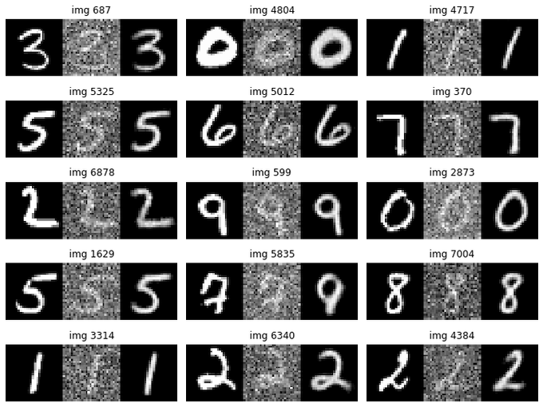

# Convolutional Autoencoder
Convolutional autoencoder implementation in TensorFlow for image denoising. Figure displays original, original + gaussian noise and reconstructed, for random images in the test set.

<p align="center">
  
</p>


## Installation

To install the dependencies, run the following command:

```bash
pip install -r requirements.txt
```

If using Conda, you can also create an environment with the requirements:

```bash
conda env create -f environment.yml
```

By default the environment name is `convolutional-autoencoder`. To activate it run:

```bash
conda activate convolutional-autoencoder 
```


## Usage

Open and execute the cells in `convolutional_autoencoder.ipynb` from `notebooks/`. 

